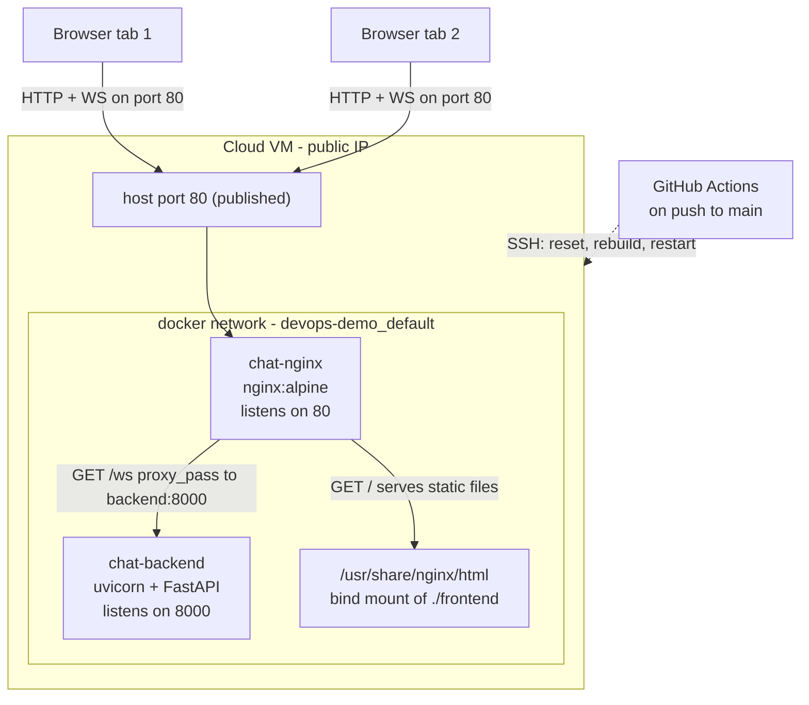

# Real-Time Chat — Containerised Deployment

A FastAPI WebSocket chat server sitting behind an NGINX reverse proxy, both running as
Docker containers, deployed to a cloud VM and redeployed automatically by GitHub Actions
on every push to `main`.

The application code was provided and is unchanged apart from one broken route (see
[Issues found](#issues-found-and-how-i-fixed-them)). Everything else in this repo is
deployment configuration.

**Live at:** http://\<PUBLIC_IP\>  ← *replace with your server IP before submitting*

---

## Overview

Two containers, one network:

- **`chat-backend`** — Python 3.11 / FastAPI served by uvicorn on port 8000. Holds the
  WebSocket endpoint at `/ws` and keeps the list of connected clients in memory.
- **`chat-nginx`** — `nginx:alpine` on port 80. Serves `frontend/index.html` and reverse
  proxies `/ws` to the backend, upgrading the connection to a WebSocket on the way
  through.

Only NGINX publishes a port to the host. The backend is reachable only from inside the
Docker network, so there is no way to talk to uvicorn except through the proxy.

## Architecture



Request flow:

| Request | Handled by | Result |
|---|---|---|
| `GET /` | NGINX `location /` | `frontend/index.html` off the bind mount |
| `GET /ws` (with `Upgrade: websocket`) | NGINX `location /ws` | `101 Switching Protocols`, then a raw tunnel to `backend:8000` |
| anything else | NGINX `try_files` | falls back to `index.html` |

## How the containers are set up

`Dockerfile` builds the backend only. It installs the requirements before copying
`main.py`, so a code change reuses the cached `pip install` layer instead of
reinstalling FastAPI on every build.

```dockerfile
FROM python:3.11-slim
WORKDIR /app
COPY app/requirements.txt .
RUN pip install --no-cache-dir -r requirements.txt
COPY app/main.py .
EXPOSE 8000
CMD ["uvicorn", "main:app", "--host", "0.0.0.0", "--port", "8000"]
```

NGINX isn't built at all — it uses the stock `nginx:alpine` image with two read-only
bind mounts, one for the config and one for the static files. Nothing writes to either,
so `:ro` costs nothing and stops a compromised NGINX from editing the config it runs on.

Both services use `restart: always`, which means Docker restarts them if the process
crashes *and* brings them back up when the daemon starts. As long as Docker itself is
enabled at boot (`systemctl enable docker`), the stack survives a server reboot with no
manual step.

The backend also has a healthcheck, and NGINX declares `depends_on: condition:
service_healthy`. Plain `depends_on` only waits for the container to be *created*, not
for uvicorn to actually be listening — that's a race you eventually lose on a slow VM.
With the healthcheck, NGINX doesn't start until the backend answers HTTP.

## How Docker networking works here

Compose creates a bridge network (`devops-demo_default`) and attaches both containers to
it. On that network Docker runs an embedded DNS server at `127.0.0.11`, which resolves
**service names** to the container's current IP. So `backend` resolves from inside the
NGINX container, and it keeps resolving after a rebuild even though the IP changes.

That's the whole reason `proxy_pass http://backend:8000` works and
`proxy_pass http://localhost:8000` does not. Each container has its own network
namespace, so inside `chat-nginx`, `localhost` is `chat-nginx` — NGINX proxying to
itself.

Port exposure is deliberately asymmetric:

- `backend` uses `expose: 8000`, which is documentation plus intra-network reachability. It publishes nothing to the host.
- `nginx` uses `ports: "80:80"`, the only thing bound on the public interface.

Practical effect: you cannot reach `http://<PUBLIC_IP>:8000` at all. The only way in is
port 80 through the proxy, which is what you want in production — one entry point to
secure, rate limit, and terminate TLS on later.

## How the NGINX reverse proxy works

`nginx.conf` is mounted over `/etc/nginx/nginx.conf`, so it replaces the default config
outright (that's why it needs the full `events { }` / `http { }` scaffolding rather than
just a server block).

```nginx
location / {
    root /usr/share/nginx/html;
    index index.html;
    try_files $uri $uri/ /index.html;
}
```

Static files are served straight off disk by NGINX — the Python process never sees them,
which is the point of putting a proxy in front.

```nginx
location /ws {
    proxy_pass http://backend:8000/ws;
    ...
}
```

`location /ws` matches first for the WebSocket path and hands it to the backend. The
`X-Real-IP` / `X-Forwarded-For` / `X-Forwarded-Proto` headers are set so the backend can
still see the real client instead of the proxy's address once you start logging or rate
limiting.

## How WebSocket works through NGINX

A WebSocket starts life as an ordinary HTTP/1.1 GET carrying two hop-by-hop headers:

```
GET /ws HTTP/1.1
Upgrade: websocket
Connection: Upgrade
```

Hop-by-hop headers are, by definition, *not* forwarded by a proxy. NGINX strips them
unless you put them back explicitly, and it defaults to HTTP/1.0 upstream, which has no
concept of an upgrade at all. Miss either piece and NGINX answers the handshake as a
normal HTTP request — the browser gets a `200` instead of a `101` and immediately closes
the socket. That is exactly the "Disconnected" symptom this repo shipped with.

Three directives make it work:

```nginx
proxy_http_version 1.1;                      # 1.0 can't upgrade
proxy_set_header Upgrade $http_upgrade;      # replay the client's Upgrade header
proxy_set_header Connection "upgrade";       # tell upstream this is an upgrade
```

Once the backend replies `101 Switching Protocols`, NGINX stops parsing HTTP and just
shovels bytes in both directions for the life of the connection.

The other half is the timeout. NGINX's default `proxy_read_timeout` is 60 seconds, and
an idle chat tab sends nothing — so a working connection would still get cut a minute
in. `proxy_read_timeout` / `proxy_send_timeout` are set to `86400s` to keep idle sockets
alive.

You can confirm the handshake in the access log; a healthy connection logs `101`, not
`200`:

```
"GET /ws HTTP/1.1" 101 203 "-" "Mozilla/5.0 ..."
```

## How the CI/CD pipeline works

`.github/workflows/deploy.yml` runs on every push to `main` (and on demand via
**workflow_dispatch**). Two jobs, gated:

**1. `build`** — runs on the GitHub runner, never touches the server:

- `docker compose config -q` catches YAML and schema errors
- `docker compose build` catches a broken Dockerfile
- brings the stack up with `--wait` (which blocks on the healthcheck), curls `/` to
  confirm the UI is served, then opens **two** WebSocket clients through NGINX and
  asserts a message sent by one arrives at the other

That last step is the important one. It's an end-to-end check of the exact three things
that were broken — bind address, proxy target, upgrade headers — so a regression fails
CI instead of the live site. On failure it dumps `docker compose logs` before tearing
down.

**2. `deploy`** — `needs: build`, so a red build never reaches the server. It SSHes in
with `appleboy/ssh-action` and:

- clones the repo on first run, otherwise `git fetch` + `git reset --hard origin/main`
  (a hard reset rather than `git pull` so a dirty working tree on the server can't
  block or half-merge a deploy)
- `docker compose up -d --build --wait` — rebuilds changed images and waits for health
- `docker image prune -f` — free-tier disks are small and untagged layers add up fast
- curls `/` as a post-deploy check, so a deploy that leaves the site down fails the run

Required repository secrets (**Settings → Secrets and variables → Actions**):

| Secret | Value |
|---|---|
| `SSH_HOST` | server public IP |
| `SSH_USER` | login user, e.g. `ubuntu` or `opc` |
| `SSH_KEY` | the **private** key, full PEM including header/footer lines |
| `SSH_PORT` | optional, defaults to 22 |

## Issues found and how I fixed them

The stack came up with `docker-compose up -d --build` but nothing worked. Three planted
misconfigurations, one per file:

### 1. Backend bound to loopback — `Dockerfile`

```diff
-CMD ["uvicorn", "main:app", "--host", "127.0.0.1", "--port", "8000"]
+CMD ["uvicorn", "main:app", "--host", "0.0.0.0", "--port", "8000"]
```

`127.0.0.1` binds the container's own loopback interface. Every container has its own
network namespace, so that socket was reachable only by processes *inside*
`chat-backend` — NGINX got connection refused. Binding `0.0.0.0` listens on all
interfaces including the bridge network one. This does not expose it publicly; that's
still controlled by whether a port is published, and the backend publishes none.

**Symptom:** `502 Bad Gateway` from NGINX; `connect() failed (111: Connection refused)`
in its error log.

### 2. Frontend never mounted — `docker-compose.yml`

```diff
-      # TODO: Candidates need to map the frontend directory correctly to serve the HTML
-      # - ./frontend:/usr/share/nginx/html:ro
+      - ./frontend:/usr/share/nginx/html:ro
```

The mount was commented out, so `/usr/share/nginx/html` still held the image's default
content and every visitor got the "Welcome to nginx!" page.

**Symptom:** default NGINX landing page at `http://localhost`.

### 3. WebSocket proxy misconfigured — `nginx.conf`

```diff
-            proxy_pass http://localhost:8000/ws;
+            proxy_pass http://backend:8000/ws;
             proxy_http_version 1.1;
-            # proxy_set_header Upgrade $http_upgrade;
-            # proxy_set_header Connection "upgrade";
+            proxy_set_header Upgrade $http_upgrade;
+            proxy_set_header Connection "upgrade";
```

Two separate faults. `localhost` inside the NGINX container is NGINX, so it was proxying
to itself; the fix is the Compose service name, which Docker's embedded DNS resolves.
And with the two upgrade headers commented out the handshake completed as plain HTTP, so
the socket closed immediately.

**Symptom:** UI loads, badge stuck on "Disconnected", `200` instead of `101` in the
access log.

### Also fixed

- **`GET /` on the backend returned a 500.** It served
  `FileResponse(<repo>/frontend/index.html)`, but the image only copies `app/`, so the
  path resolved to `/frontend/index.html` — which doesn't exist in the container. NGINX
  owns the static files, so the route is now a small `{"status": "ok"}` liveness check,
  which is also what the container healthcheck hits. This is the only application file
  touched, and only to remove a route that could not work in a container.
- **Imports hidden inside route handlers** (`import os`, `from fastapi.responses import
  Response`) moved to the top of the module.
- **`app/__pycache__/` was committed.** Removed from the index, added `.gitignore` and
  `.dockerignore` so compiled bytecode stays out of both the repo and the build context.
- **`version: '3.8'` removed** from the Compose file — obsolete under Compose v2, and it
  prints a deprecation warning on every single command including in CI logs.

## Deploying to a server

Tested on Ubuntu 22.04. Adjust the package steps for other distros.

**1. Install Docker and enable it at boot**

```bash
curl -fsSL https://get.docker.com | sh
sudo usermod -aG docker $USER          # log out and back in for this to apply
sudo systemctl enable --now docker     # required for restart: always to survive reboots
```

**2. Open port 80**

In your provider's console, add an ingress rule for TCP/80 to the VM's security group
(AWS), firewall rule (GCP) or security list (Oracle Cloud).

Oracle Cloud has a second, easy-to-miss layer: their Ubuntu images ship local iptables
rules that drop 80 even after the security list allows it. If the port is open in the
console and still times out, that's why:

```bash
sudo iptables -I INPUT 6 -m state --state NEW -p tcp --dport 80 -j ACCEPT
sudo netfilter-persistent save
```

**3. First deploy**

```bash
git clone https://github.com/<user>/devops-demo.git ~/devops-demo
cd ~/devops-demo
docker compose up -d --build
```

**4. Wire up CI/CD**

Generate a deploy key, authorise it, and hand the private half to GitHub:

```bash
ssh-keygen -t ed25519 -C "github-actions" -f ~/.ssh/gh_deploy -N ""
cat ~/.ssh/gh_deploy.pub >> ~/.ssh/authorized_keys
cat ~/.ssh/gh_deploy          # paste this into the SSH_KEY secret
```

Add the four secrets listed above, then push to `main`. Every push from that point
builds, smoke tests, and redeploys on its own.

## Running locally

```bash
docker compose up -d --build
```

Open http://localhost in two tabs — the header should show "Connected", the user count
should read 2, and messages should appear in both tabs instantly.

To verify the pieces individually:

```bash
# UI is served by NGINX
curl -s http://localhost/ | grep -o "<title>.*</title>"

# backend is reachable by service name from inside the NGINX container
docker compose exec nginx wget -qO- http://backend:8000/

# the WebSocket handshake returned 101, not 200
docker compose logs nginx | grep "/ws"
```

Tear down with `docker compose down`.

## Things I'd do next

Everything above is what it took to get this working and deployed. These are the gaps
I'd close before calling it production, roughly in the order I'd do them.

**HTTPS.** The whole conversation is plaintext over port 80 right now. A domain plus
Let's Encrypt via certbot, redirect 80 → 443, and the client switches to `wss://` on its
own — `index.html` already picks the scheme from `window.location.protocol`.

**Reconnect in the client.** `socket.onclose` flips the badge to "Disconnected" and gives
up. Every redeploy therefore leaves open tabs dead until someone hits refresh, which is a
bad look for a pipeline that redeploys on every push. Needs a reconnect with exponential
backoff.

**Fault isolation in the broadcast loop.** `broadcast_chat_message()` awaits each
`send_text` in sequence over `active_connections`. If one socket has already gone away
the send raises, the loop aborts, and every client after it in the list silently misses
the message — while the dead entry stays in the list. `asyncio.gather(...,
return_exceptions=True)` plus pruning the failures fixes both halves.

**Horizontal scaling.** `ConnectionManager` holds all state in a dict in one process, so
the backend can't run more than one replica — two instances would each broadcast to their
own half of the room. Redis pub/sub for fan-out is the prerequisite for a second replica,
and for zero-downtime deploys (right now `up -d --build` drops every connection).

**Persistence.** History lives only in the browser DOM; a refresh loses the conversation.
Postgres or Redis streams, with a short replay on connect.

**Auth and abuse limits.** Anyone who can reach `/ws` gets a `Guest_XXXX` and full
broadcast rights. A token validated before `websocket.accept()`, plus a per-connection
message rate and size cap enforced in the endpoint — `client_max_body_size` doesn't
apply to WebSocket frames, so NGINX can't do it for you.

**Reproducible builds.** `requirements.txt` uses `>=` ranges, so two builds a month apart
can ship different FastAPI versions. Pin exact versions with a lockfile and pin the base
image by digest rather than the `python:3.11-slim` tag. Same argument for
`nginx:alpine`.

**Non-root container.** The backend runs as root. A `USER` line and an unprivileged
account in the Dockerfile costs nothing here.

**Observability.** No structured logs and no metrics — there's currently no way to know
how many sockets are open without opening a browser tab. JSON logging plus a `/metrics`
endpoint exposing a connection gauge, message counter and handshake failures.

**Image-based static files.** The `frontend/` bind mount is convenient, but it means the
running site depends on the host filesystem. Baking the static files into a small NGINX
image makes the deploy a single immutable artifact and lets you roll back by tag.
